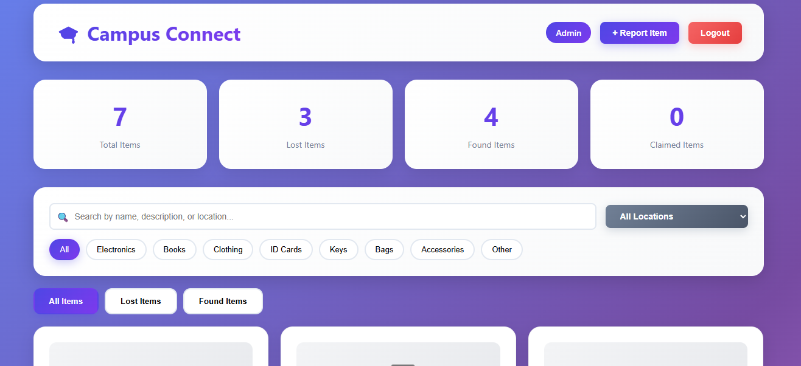
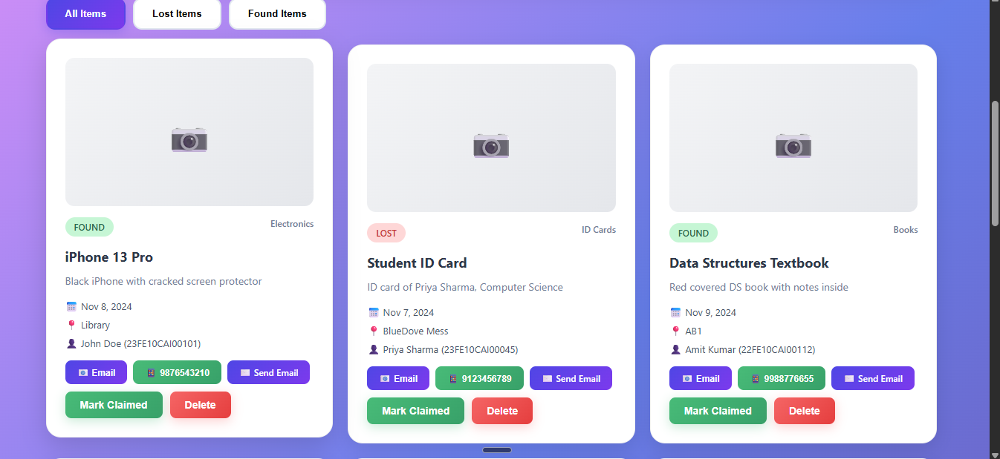
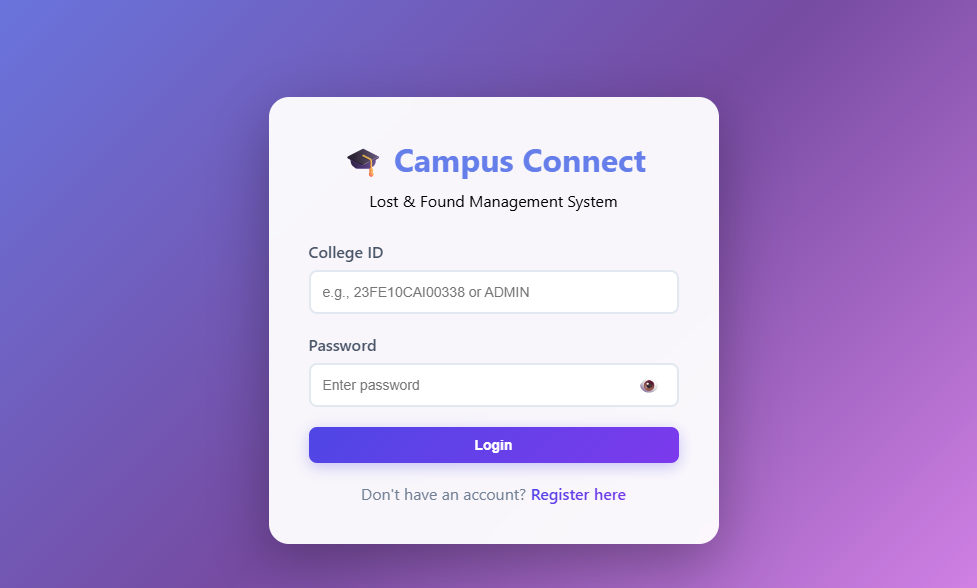
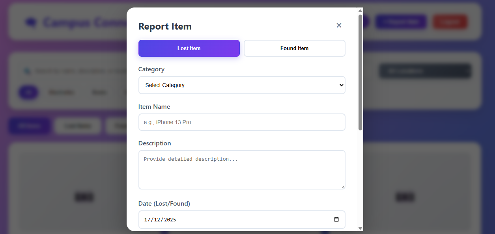

# CampusConnect

CampusConnect is a simple and intuitive **Lost & Found web platform** designed to help users report, discover, and recover lost items within a campus-like environment.

The platform allows users to post details of lost or found items, browse listings, and directly contact the concerned person — all through a clean and user-friendly interface.

---
## 🌐 Live Demo
https://anirudh-saini10.github.io/CampusConnect/


## 🚀 Features

- 📦 Report **Lost** or **Found** items with images and details  
- 🔍 Browse items by category and status  
- 📞 Contact item owners or finders directly  
- 🛠️ Admin controls to manage and remove listings  
- 🎨 Clean, modern UI focused on usability  

---

## 🛠️ Tech Stack

- HTML5  
- CSS3  
- JavaScript (Vanilla)

This project is fully frontend-based and focuses on UI design, logic, and interaction flow.

---
## 🖼️ Preview






## 👥 Contributors
- Anirudh ([@Anirudh-Saini10](https://github.com/Anirudh-Saini10))
- Ashaz Ali Khan([@ashazalikhan014-coder](https://github.com/ashazalikhan014-coder))

## ▶️ Running the Project

1. Clone the repository:
   ```bash
   git clone https://github.com/Anirudh-Saini10/CampusConnect.git

